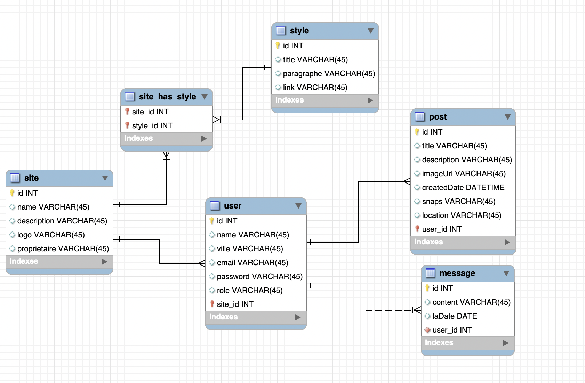

# pabiosoft multi site version 0.1
## _Rapport Full Stack developpeur Angular PHP

[](http:pabiosoft.com)

[](http://pabiosoft.com)


2022
- ✨Evaluation ✨
- ✨ les view du back pour la presentation ✨
## MLD



## Installation

```sh
cd back
php -S localhost:9000
cd front 
ng serve 

```

Projet pour une  presentation

## Techno

Une liste non exchaustive d

| back | README |
| ------ | ------ |
| PHP | [backend] |
| MVC | [en designe patherne] |
| Doctrine | [3 des 6 tables]|
| Fast Router  | [pour le routing] |

| Front    |    README |
| ------    | ------ |
| ANGULAR | [le Frontend] |
| approche Modulaire | [ pour les Cores et Futures module] |
|lazy loading | [ pour le routing] |
| Pusher | [ comme websocket pour le chat] |


Want to contribute? Great!


## License

MIT

**Free Software, Ismaila balde!**
  
